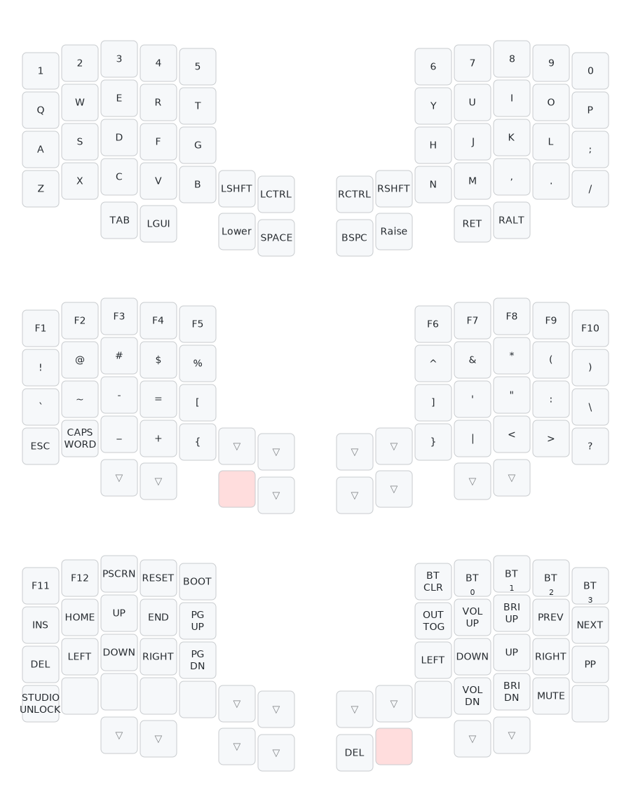

# Turing split — ZMK config

ZMK firmware config for the [Turing split keyboard](https://github.com/lordbagel42/highway-split-keyboard)
(52 keys: 5 columns + number row per hand, 4 thumb keys and 2 inner-cluster keys per side),
running on a pair of nice!nano v2s.

## Keymap



Layout notes (conventions borrowed from Sofle / Lily58 / Corne):

- **Space** on the left inner thumb, **Backspace** on the right inner thumb.
- **Lower** (symbols + F-keys) and **Raise** (nav / media / Bluetooth) are held
  with the thumb key right next to Space / Backspace.
- **Shift + Ctrl** live on the inner-cluster keys of *both* hands, so you can
  always chord with the opposite hand.
- Hold **Raise** and tap Backspace for **Delete**.
- `Lower + Z-position` is Escape, `Lower + X-position` toggles Caps Word
  (types one WORD in caps, then turns itself off).
- Arrows are on Raise, on both hands: inverted-T on the left, vim-style HJKL on
  the right.
- `Raise + 4/5-position` are `&sys_reset` / `&bootloader` for easy reflashing.
- Layers *Extra 1* and *Extra 2* are empty spares for ZMK Studio (Studio can
  edit layers but not create them).

## ZMK Studio

The CI build produces a `turing_left_studio` artifact built with the
`studio-rpc-usb-uart` snippet and `CONFIG_ZMK_STUDIO=y`. To edit the keymap
live without reflashing:

1. Flash `turing_left_studio` to the **left** (central) half. The right half
   keeps its normal `turing_right` firmware.
2. Plug the left half in over USB and open <https://zmk.studio> in
   Chrome/Edge (or use the desktop app).
3. The keymap is locked by default — hold **Raise** and tap the **Z-position
   key** (`STUDIO UNLOCK`) to let Studio make changes.

## Regenerating the keymap diagram

The diagram is drawn with [keymap-drawer](https://github.com/caksoylar/keymap-drawer):

```sh
pip install keymap-drawer
keymap parse -z config/turing.keymap > keymap-drawer/turing.yaml
keymap draw keymap-drawer/turing.yaml \
  -d boards/shields/turing/turing-layouts.dtsi \
  -s Base Lower Raise > keymap-drawer/turing.svg
```
